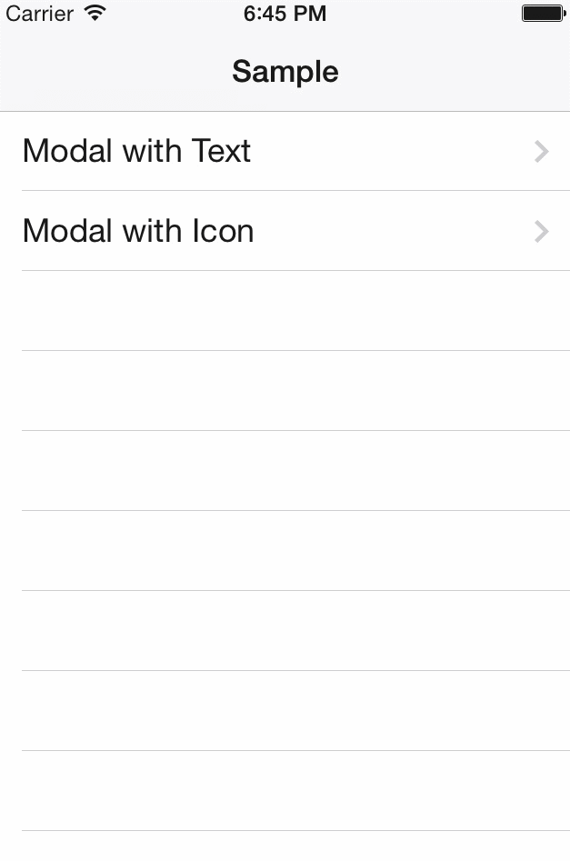

# QMBModalNavigationController  #

- Add a "done"-Button automatically as the left navigation bar item
- Supports Font Awesome Icons
- Simple UINavigationController Subclass



## Pod ##

```gem
pod 'QMBModalNavigationController'
```

## Dependencies ## 

- [FontAwesomeIconFactory](https://github.com/nschum/FontAwesomeIconFactory)
